# 100-days-of-swiftui

https://www.hackingwithswift.com/100/swiftui

## Notes

- This is 100 days of **SwiftUI**. For 100 days of **Swift**, look [100-days-of-swift](https://github.com/fauzandwip/100-days-of-swift).
- Reference the readme format of [clarknt](https://github.com/clarknt).

## Previews

_Within each project are larger versions of the screenshots._

| Projects / Topics                                                                                                                                                                                      | Screenshots                                                                                                                                                                                                                                                                                                                                                                                           |
| ------------------------------------------------------------------------------------------------------------------------------------------------------------------------------------------------------ | ----------------------------------------------------------------------------------------------------------------------------------------------------------------------------------------------------------------------------------------------------------------------------------------------------------------------------------------------------------------------------------------------------- |
| [Project 1](01_Project1_HWSwiftUI) - **Storm Viewer**  Form, Section, NavigationView,  @State property wrapper,   TextField, Picker, ForEach              |  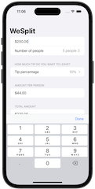                                                                                                                                                                                                                                                                     |
| [Challenge Day 1](02_Challenge-Day1_HWSwiftUI) -  **Unit Conversions**                                                                                                              | 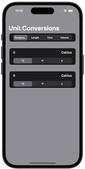 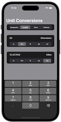                                                                                                                                                                                                                                                         |
| [Project 2](03_Project2_HWSwiftUI) - **Guess The Flag**  VStack, Image, Alert                                                                                                           | 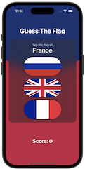 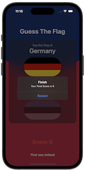                                                                                                                                                                                                                                                                     |
| [Project 3](04_Project3_HWSwiftUI) - **View and Modifiers**  Views, modifiers, composition, containers                                                                                  |                                                                                                                                                                                                                                                                                                                                       |
| [Milestone Projects 1-3](05_Milestone-Projects1-3_HWSwiftUI) -   **Rock Paper Scissors**                                                                                            |  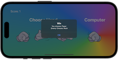                                                                                                                                                                                                                                           |
| [Project 4](06_Project4_HWSwiftUI) - **BetterRest**  Machine Learning, Dates  (DatePicker, DateComponents, DateFormatter),  Stepper, navigationBarItems() | 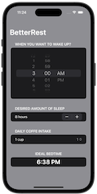                                                                                                                                                                                                                                                                                                                                      |
| [Project 5](07_Project5_HWSwiftUI) - **Word Scramble**  List, onAppear, Bundle,  fatalError(), UITextChecker                                                             | 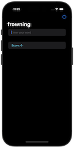                                                                                                                                                                                                                                                                      |
| [Project 6](08_Project6_HWSwiftUI) - **Animations**  Animations and transitions                                                                                                         |   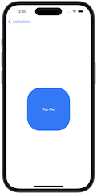 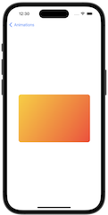                                                                                                                                   |
| [Milestone Projects 4-6](09_Milestone-Projects4-6_HWSwiftUI) -   **Edutainment**                                                                                                    |                                                                                   |
| [Project 7](10_Project7_HWSwiftUI) - **iExpense**  UserDefaults, Codable, sheet(),  onDelete(), @ObservedObject                                                          | 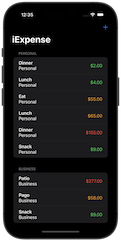 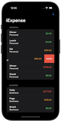                                                                                                                                                                                                     |
| [Project 8](11_Project8_HWSwiftUI) - **Moonshot**  GeometryReader, ScrollView, Navigation,  Codable hierarchy, Generics                                                  |   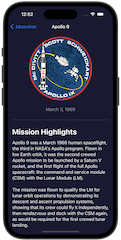  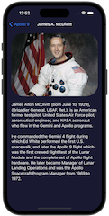                                                                  |
| [Project 9](12_Project9_HWSwiftUI) - **Drawing**  Paths, shapes, strokes, transforms,  drawing groups, Core Animation,  animating values, Metal           |      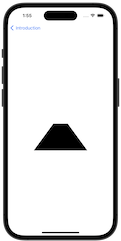 |
| [Milestone Projects 7-9](13_Milestone-Projects7-9_HWSwiftUI) -   **Habits Track**                                                                                                   |  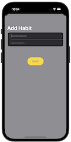                                                                                 |
