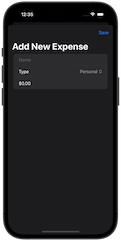

# 100DaysOfSwiftUI

  

This repository includes all of the projects from Paul Hudson's [100 Days of SwiftUI](https://www.hackingwithswift.com/100/swiftui) course.

I have done all of the optional challenges as well (You can find this information inside the project directories).

These projects were built for iOS 16 with Xcode 14.

## Notes

- This is 100 days of **SwiftUI**. For 100 days of **Swift**, look [100-days-of-swift](https://github.com/fauzandwip/100-days-of-swift).
- Reference the readme format of [clarknt](https://github.com/clarknt) and [MatthewWurl](https://github.com/MatthewWurl).

## Previews

_Within each project are larger versions of the screenshots._

| Projects / Topics                                                                                                                                                                          | Screenshots                                                                                                                                                                                                                                                                                                                                                                                           |
| ------------------------------------------------------------------------------------------------------------------------------------------------------------------------------------------ | ----------------------------------------------------------------------------------------------------------------------------------------------------------------------------------------------------------------------------------------------------------------------------------------------------------------------------------------------------------------------------------------------------- |
| [Project 1](01_Project1_HWSwiftUI) - **Storm Viewer**  Form, Section, NavigationView,   @State property wrapper,   TextField, Picker, ForEach |                                                                                                                                                                                                                                                                       |
| [Challenge Day 1](02_Challenge-Day1_HWSwiftUI) -   **Unit Conversions**                                                                                                 |                                                                                                                                                                                                                                                           |
| [Project 2](03_Project2_HWSwiftUI) - **Guess The Flag**  VStack, Image, Alert                                                                                               |                                                                                                                                                                                                                                                                       |
| [Project 3](04_Project3_HWSwiftUI) - **View and Modifiers**  Views, modifiers, composition, containers                                                                      |                                                                                                                                                                                                                                                                                                                                       |
| [Milestone Projects 1-3](05_Milestone-Projects1-3_HWSwiftUI) -   **Rock Paper Scissors**                                                                                |                                                                                                                                                                                                                                             |
| [Project 4](06_Project4_HWSwiftUI) - **BetterRest**  Machine Learning, Dates (DatePicker, DateComponents,   DateFormatter), subStepper, navigationBarItems() |                                                                                                                                                                                                                                                                                                                                       |
| [Project 5](07_Project5_HWSwiftUI) - **Word Scramble**  List, onAppear, Bundle, fatalError(), UITextChecker                                                                 |                                                                                                                                                                                                                                                                       |
| [Project 6](08_Project6_HWSwiftUI) - **Animations**  Animations and transitions                                                                                             |                                                                                                                                       |
| [Milestone Projects 4-6](09_Milestone-Projects4-6_HWSwiftUI) -   **Edutainment**                                                                                        |                                                                                   |
| [Project 7](10_Project7_HWSwiftUI) - **iExpense**  UserDefaults, Codable, sheet(),   onDelete(), @ObservedObject                                             |                                                                                                                                                                                                       |
| [Project 8](11_Project8_HWSwiftUI) - **Moonshot**  GeometryReader, ScrollView, Navigation,   Codable hierarchy, Generics                                     |                                                                       |
| [Project 9](12_Project9_HWSwiftUI) - **Drawing**  Paths, shapes, strokes, transforms, drawing groups,   Core Animation, animating values, Metal              |       |
| [Milestone Projects 7-9](13_Milestone-Projects7-9_HWSwiftUI) -   **Habits Track**                                                                                       |                                                                                   |
| [Project 10](14_Project10_HWSwiftUI) - **Cupcake Corner**  Codable, URLSession, disabled()                                                                                  |                                                                                                                                                                                                    |
| [Project 11](15_Project11_HWSwiftUI) - **Bookworm**  Core Data, @Binding, Custom Components                                                                                 |                                                                                                                                                                                                    |
| [Project 12](16_Project12_HWSwiftUI) - **Core Data**  Core Data                                                                                                             |                                                                                                                                                                                                                                                                     |
| [Milestone Projects 10-12](17_Milestone-Projects10-12_HWSwiftUI) -   **Users List**                                                                                     |                                                                                                                                                          |
| [Project 13](18_Project13_HWSwiftUI) - **Instafilter**  UIKit integration, Core Image, Custom bindings, Action Sheets                                                       |                                                                                                                                   |
| [Project 14](19_Project14_HWSwiftUI) - **Bucket List**  MapKit, Biometric authentication, Secure data writing, Comparable custom types, Documents directory                 |                                                                                                                                   |
| [Project 15](20_Project15_HWSwiftUI) - **Accessibility**  Accessibility                                                                                                     |                                                                                                                                                                                                                                                                     |
